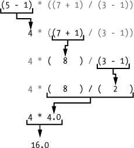

# Expressions and the REPL

We will now play around in the REPl for a bit, so open the REPL.

\
Enter 2 + 2 at the prompt to have Python do some simple math. The REPL window should now look like this:

```
>>> 2 + 2
4
>>>
```

In Python, 2 + 2 is called an _expression_, which is the most basic kind of programming instruction in the language. Expressions consist of _values_ (such as 2) and _operators_ (such as +), and they can always _evaluate_ (that is, reduce) down to a single value. That means you can use expressions anywhere in Python code that you could also use a value.

In the previous example, 2 + 2 is evaluated down to a single value, 4. A single value with no operators is also considered an expression, though it evaluates only to itself, as shown here:

```
>>> 2
2
```

> **ERRORS ARE OKAY!**
>
> Programs will crash if they contain code the computer can’t understand, which will cause Python to show an error message. An error message won’t break your computer, though, so don’t be afraid to make mistakes. A _crash_ just means the program stopped running unexpectedly.
>
> If you want to know more about an error, you can search for the exact error message text online for more information. You can also check out the resources at [_https://nostarch.com/automatestuff2/_](https://nostarch.com/automatestuff2/) to see a list of common Python error messages and their meanings.

You can use plenty of other operators in Python expressions, too. For example, Table 1-1 lists all the math operators in Python.

**Table 1-1:** Math Operators from Highest to Lowest Precedence

| **Operator** | **Operation**                     | **Example** | **Evaluates to . . .** |
| ------------ | --------------------------------- | ----------- | ---------------------- |
| \*\*         | Exponent                          | 2 \*\* 3    | 8                      |
| %            | Modulus/remainder                 | 22 % 8      | 6                      |
| //           | Integer division/floored quotient | 22 // 8     | 2                      |
| /            | Division                          | 22 / 8      | 2.75                   |
| \*           | Multiplication                    | 3 \* 5      | 15                     |
| -            | Subtraction                       | 5 - 2       | 3                      |
| +            | Addition                          | 2 + 2       | 4                      |

The _order of operations_ (also called _precedence_) of Python math operators is similar to that of mathematics. The \*\* operator is evaluated first; the \*, /, //, and % operators are evaluated next, from left to right; and the + and - operators are evaluated last (also from left to right). You can use parentheses to override the usual precedence if you need to. Whitespace in between the operators and values doesn’t matter for Python (except for the indentation at the beginning of the line), but a single space is convention. Enter the following expressions into the interactive shell:

```
>>> 2 + 3 * 6
20
>>> (2 + 3) * 6
30
>>> 48565878 * 578453
28093077826734
>>> 2 ** 8
256
>>> 23 / 7
3.2857142857142856
>>> 23 // 7
3
>>> 23 % 7
2
>>> 2      +           2
4
>>> (5 - 1) * ((7 + 1) / (3 - 1))
16.0
```

In each case, you as the programmer must enter the expression, but Python does the hard part of evaluating it down to a single value. Python will keep evaluating parts of the expression until it becomes a single value, as shown here:



These rules for putting operators and values together to form expressions are a fundamental part of Python as a programming language, just like the grammar rules that help us communicate. Here’s an example:

**This is a grammatically correct English sentence.**

**This grammatically is sentence not English correct a.**

The second line is difficult to parse because it doesn’t follow the rules of English. Similarly, if you enter a bad Python instruction, Python won’t be able to understand it and will display a SyntaxError error message, as shown here:

```
>>> 5 +
  File "<stdin>", line 1
    5 +
      ^
SyntaxError: invalid syntax
>>> 42 + 5 + * 2
  File "<stdin>", line 1
    42 + 5 + * 2
             ^
SyntaxError: invalid syntax
```

You can always test to see whether an instruction works by entering it into the interactive shell. Don’t worry about breaking the computer: the worst that could happen is that Python responds with an error message. Professional software developers get error messages while writing code all the time.
